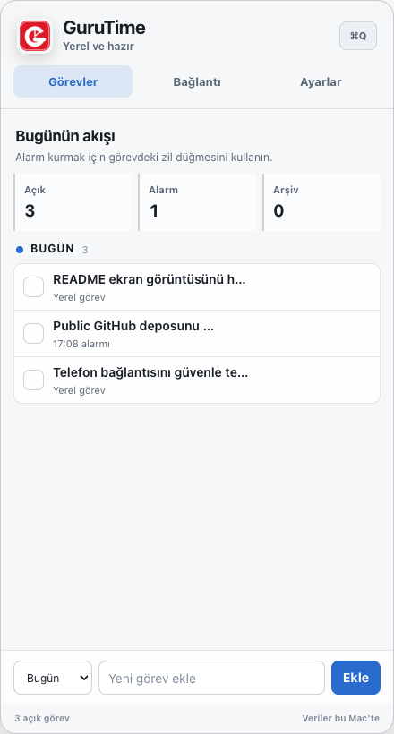

# GuruTime

GuruTime, macOS menü çubuğunda yaşayan, görevleri alarm ve hatırlatıcılara dönüştüren açık kaynak bir üretkenlik uygulamasıdır. Önceliği yerel çalışmak, hızlı erişim ve veriyi kullanıcının Mac'inde tutmaktır.



## Neler sunuyor?

- Görevleri **Önemli**, **Bugün** ve **Bir Ara** başlıklarında düzenleme
- Her görev için dakikalar içinde alarm kurma
- Menü çubuğundan hızlı erişim ve görsel zamanlayıcı
- Tamamlanan görevleri arşivleme ve geri getirme
- İsteğe bağlı yerel parola kilidi
- Aynı ağdaki telefondan, tek kullanımlık QR kodla kontrol
- İsteğe bağlı Cloudflare relay ve Web Push desteği
- Hermes/terminal araçları için komut satırı köprüsü
- Apple Silicon ve Intel Mac'ler için universal uygulama paketi

GuruTime'ın temel görev ve alarm özellikleri internet bağlantısı olmadan çalışır. Telefon bağlantısı ve bulut relay'i isteğe bağlıdır.

## Hızlı başlangıç

Gereksinimler:

- macOS 12 veya daha yeni bir sürüm
- Node.js 22.12 veya daha yeni bir sürüm
- npm

Projeyi çalıştırmak için:

```bash
git clone https://github.com/gurursonmez90/GuruTime.git
cd GuruTime
npm ci
npm start
```

GuruTime menü çubuğuna eklenir. Uygulama simgesine tıklayarak görev penceresini açabilirsiniz.

## Kullanım

1. Alt bölümdeki alana görev adını yazın ve kategorisini seçin.
2. **Ekle** düğmesiyle görevi listenize alın.
3. Görev satırındaki **Alarm** düğmesine basıp süreyi seçin.
4. Tamamladığınız görevi işaretleyin; dilerseniz arşivleyin veya silin.

### Komut satırı

Uygulama kurulu ve açıkken terminalden görev ya da alarm ekleyebilirsiniz:

```bash
npm run cli -- note "Sunum notlarını düzenle" --category important
npm run cli -- alarm "Toplantıya hazırlan" --in 20m
npm run cli -- list
```

Tüm komutları görmek için:

```bash
npm run cli -- --help
```

## Telefon bağlantısı

Telefon desteği iki farklı biçimde kullanılabilir:

- **Yerel ağ:** Komutlar yalnızca aynı ağ içindeki Mac'e gider.
- **Cloudflare relay:** Uçtan uca şifreli komut aktarımı ve ikincil Web Push bildirimi sağlar.

Eşleştirme bağlantıları tek kullanımlıktır ve 10 dakika sonra geçersiz olur. Kurulum ayrıntıları için [Cloudflare relay rehberine](cloud/cloudflare-relay/README.md) bakın.

## Gizlilik ve güvenlik

- Görevler ve alarmlar varsayılan olarak Mac'inizde saklanır.
- Electron pencereleri context isolation, sandbox ve kapalı Node entegrasyonuyla çalışır.
- Yerel parola düz metin tutulmaz; `scrypt` ile türetilmiş kayıt saklanır.
- QR eşleştirmesi kısa ömürlü ve tek kullanımlıdır.
- Gizli anahtarlar kaynak koduna eklenmez; yayın sürecinde paket içeriği ayrıca taranır.

Yerel uygulama kilidi, ekrandaki erişimi sınırlar; disk şifrelemesinin yerini almaz. Hassas veriler için macOS FileVault kullanılması önerilir.

## Geliştirme

```bash
npm ci
npm run check
npm test
```

Cloudflare Worker'ını ayrıca doğrulamak için:

```bash
npm --prefix cloud/cloudflare-relay ci
npm run cloud:check
npm run test:cloud
```

Universal macOS paketi için yayın süreci, imzalama ve noter onayı gerektirir. Ayrıntılar [yayın rehberinde](docs/release/README.md) yer alır.

## Katkıda bulunma

Hata bildirimi, geliştirme önerisi ve pull request'ler memnuniyetle karşılanır. Değişiklik göndermeden önce `npm run check` ve `npm test` komutlarının geçtiğini doğrulayın.

## Lisans

Bu proje [MIT Lisansı](LICENSE) ile sunulur.
