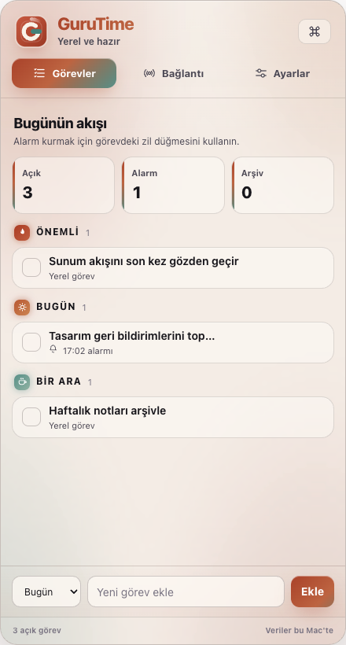
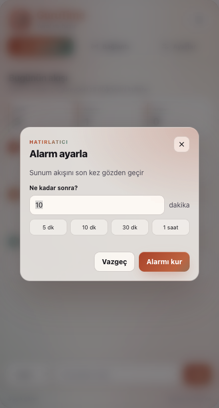
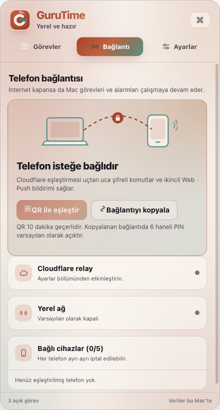
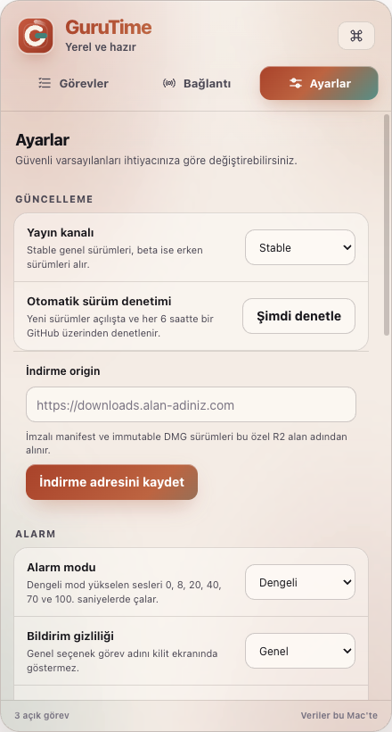

# GuruTime

GuruTime, macOS menü çubuğundan birkaç saniyede görev ve alarm oluşturmanızı sağlayan açık kaynak bir zamanlayıcıdır. Temel özellikleri internetsiz çalışır ve verilerinizi Mac'inizde tutar.

<p align="center">
  
</p>

Menü çubuğundaki GuruTime simgesini aşağı çekin. Halat uzadıkça süre artar; bıraktığınızda görev adını yazıp alarmı kurarsınız.

## Kolay kurulum

Gerekenler: **macOS 12+** ve **Node.js 22.12+**.

Aşağıdaki tek satırı Terminal'e yapıştırın:

```bash
git clone https://github.com/gurursonmez90/GuruTime.git && cd GuruTime && npm ci && npm start
```

GuruTime menü çubuğunda açılır. Sonraki açılışlarda proje klasöründe yalnızca `npm start` çalıştırmanız yeterlidir.

## Menü ve görevler



1. Alttaki alana görevi yazın ve **Ekle**'ye basın.
2. Görevdeki zil düğmesinden alarm süresini seçin.
3. Biten görevi işaretleyin; isterseniz arşivleyin veya silin.

Görevlerinizi **Önemli**, **Bugün** ve **Bir Ara** bölümlerinde tutabilirsiniz. Menü çubuğundaki halat zamanlayıcı ve normal görev menüsü aynı alarm sistemini kullanır.

## Diğer ekranlar

| Alarm kurma | Telefon bağlantısı | Ayarlar ve güncelleme |
| --- | --- | --- |
|  |  |  |

## Öne çıkanlar

- Görev, alarm, arşiv ve menü çubuğu halat zamanlayıcısı
- Açılışta ve her 6 saatte bir otomatik sürüm denetimi
- Yeni sürüm bulunduğunda yerel macOS bildirimi
- İsteğe bağlı yerel parola kilidi
- Aynı ağdaki telefondan tek kullanımlık QR kodla kontrol
- İsteğe bağlı Cloudflare relay ve Web Push desteği
- Terminal araçları için komut satırı köprüsü
- Apple Silicon ve Intel Mac'ler için universal paketleme altyapısı

## Güncelleme

GuruTime, GitHub Releases sayfasını ve `main` dalındaki sürüm numarasını otomatik denetler. Daha yeni bir sürüm bulunduğunda macOS bildirimi gösterir; bildirime tıklamak yeni sürümün GitHub sayfasını açar. **Ayarlar → Güncelleme → Şimdi denetle** ile istediğiniz zaman elle de kontrol edebilirsiniz.

Kaynak kurulumunu güncellemek için:

```bash
git pull && npm ci && npm start
```

Yayıncı için: `package.json` sürümünü artıran değişiklik `main` dalına gönderildiğinde eski sürümler bunu algılar. İmzalı DMG yayın akışı yapılandırılmışsa uygulama ayrıca doğrulanmış paketi indirip açmaya hazırlar.

## Komut satırı

GuruTime açıkken terminalden görev veya alarm ekleyebilirsiniz:

```bash
npm run cli -- note "Sunum notlarını düzenle" --category important
npm run cli -- alarm "Toplantıya hazırlan" --in 20m
npm run cli -- list
```

Tüm komutlar için `npm run cli -- --help` çalıştırın.

## Telefon bağlantısı

- **Yerel ağ:** Komutlar yalnızca aynı ağdaki Mac'e gider.
- **Cloudflare relay:** Uçtan uca şifreli komut aktarımı ve ikincil Web Push bildirimi sağlar.

Eşleştirme bağlantıları tek kullanımlıdır ve 10 dakika sonra geçersiz olur. Ayrıntılar [Cloudflare relay rehberinde](cloud/cloudflare-relay/README.md) yer alır.

## Gizlilik

- Görevler ve alarmlar varsayılan olarak yalnızca Mac'inizde saklanır.
- Electron pencerelerinde context isolation ve sandbox etkindir; Node entegrasyonu kapalıdır.
- Yerel parola düz metin tutulmaz; `scrypt` ile türetilmiş kayıt saklanır.
- QR eşleştirmesi kısa ömürlü ve tek kullanımlıdır.

Yerel uygulama kilidi disk şifrelemesinin yerini almaz. Hassas veriler için macOS FileVault kullanılması önerilir.

## Geliştirme

```bash
npm ci
npm run check
npm test
```

Universal macOS paketi imzalama ve noter onayı gerektirir. Yayın ayrıntıları [release rehberinde](docs/release/README.md), sürüm notları [CHANGELOG.md](CHANGELOG.md) dosyasındadır.

## Lisans

GuruTime [MIT Lisansı](LICENSE) ile sunulur.
